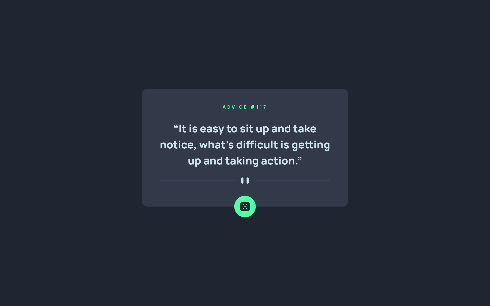

# Frontend Mentor - Advice generator app solution

This is a solution to the [Advice generator app challenge on Frontend Mentor](https://www.frontendmentor.io/challenges/advice-generator-app-QdUG-13db). Frontend Mentor challenges help you improve your coding skills by building realistic projects.

## Overview

### The challenge

Users should be able to:

-   View the optimal layout for the app depending on their device's screen size
-   See hover states for all interactive elements on the page
-   Generate a new piece of advice by clicking the dice icon

### Screenshot

### Links

-   Solution URL: [https://www.frontendmentor.io/solutions/advice-generator-app-KcaK4LXhXv](https://www.frontendmentor.io/solutions/advice-generator-app-KcaK4LXhXv)
-   Live Site URL: [https://erlynascarate.github.io/advice-generator-app/](https://erlynascarate.github.io/advice-generator-app/)

## Built with

-   Mobile-first workflow
-   [TypeScript](https://www.typescriptlang.org/)
-   [React](https://react.dev/) - JS library
-   [Sass](https://sass-lang.com/) - CSS with superpowers
-   [Vite](https://vitejs.dev/)

## Author

-   Frontend Mentor - [@erlynascarate](https://www.frontendmentor.io/profile/erlynascarate)
-   Twitter - [@erlynascarate](https://www.twitter.com/erlynascarate)
